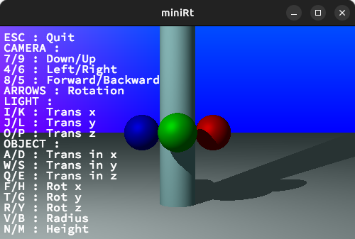

# MiniRT

<div align="center">
  
</div>
<div align="center">
<div align="center">
  <sub>Written by <a href="https://github.com/Mehourka">Karim Mehour</a> and <a href="https://github.com/vst-pier">Valerie St-Pierre</a></sub>
</div>pie
</div>

## Table of Contents
- [Introduction](#introduction)
- [Features](#features)
- [Installation](#installation)
- [Usage](#usage)
- [License](#license)


## Introduction
MiniRT is a minimal ray tracing project developed for the 42 Curriculum. It provides a single-threaded 3D renderer, written in C and using ray tracing techniques. The project uses only one library, MLX42, for image rendering, while everything else is custom-made. MiniRT also parses and loads `.rt` files for scene and object configurations, making it a comprehensive tool for learning and experimenting with computer graphics.
  <p align="center">
  
  </p>

## Features
- **Cross-Platform**: Runs  macOS, and Linux.
- **Real-Time Rendering**: Utilizes ray tracing for realistic image rendering.
- **Extensible**: Easily add new features and extend the functionality.

## Installation
### Prerequisites
- **GNU Make**: Version 3.18.0 or higher.
- **GLFW**: Version 3.3.6 or higher.
- **OpenGL**: Required for rendering.

### Building the Project
1. Clone the repository:
    ```sh
    git clone https://github.com/codam-coding-college/MiniRT.git
    cd MiniRT
    ```

2. Build the project using GNU Make:
    ```sh
	make ./maps/[Map Name].rt
	```


## License
This project is licensed under the GNU General Public License v2.0. See the LICENSE file for details.